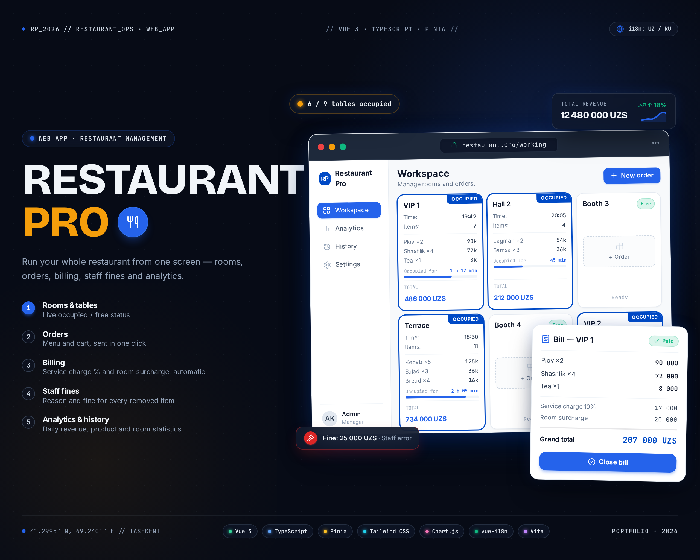

# Restaurant Pro

Restaurant Pro is a web app for running a restaurant floor. It covers rooms and tables, live orders, bills, staff fines, analytics and order history, all in one browser tab.



<details>
<summary>O'zbekcha poster</summary>


</details>

## Features

**Workspace** (`/working`)
- A card for every room shows whether it is occupied or free, when the order started, how many items it has and the running total.
- The order modal has a menu tab and a basket tab. You can add products, change quantities and send the order.
- The bill shows the subtotal, the service charge, the room surcharge and the grand total. Closing a bill moves the order to history.
  - The service charge is one global percentage, and individual rooms can opt out of it.
  - The room surcharge is a fixed amount set for each room.
- Removing an item requires a reason: *client rejected* or *employee error*. For an employee error you can pick the employee and add an optional fine.
- Decreasing a quantity requires a comment and can also carry a fine.

**Analytics** (`/analytics`)
- Filter by date range.
- Summary cards: total revenue, products sold, average bill and total fines.
- A daily revenue chart built with Chart.js.
- Breakdowns by product, by room (including occupied time) and by employee fines.

**History** (`/history`)
- A list of closed orders with the full bill breakdown and any removed items.

**Settings** (`/settings`)
- Rooms and tables: set each room's surcharge, opt a room out of the service charge, and set the global service percentage.
- Menu items: unit (kg / litre / portion), category (main, drink, dessert, snack), price and image.
- Employees: mark each one as *working* or *free*.

**Languages**
- Uzbek (the default) and Russian. You switch language at the bottom of the sidebar, and the app remembers your choice.

## Tech stack

| Area | Tools |
|---|---|
| Framework | Vue 3 (`<script setup>`), TypeScript |
| Build | Vite |
| State | Pinia |
| Routing | Vue Router |
| i18n | vue-i18n |
| Styling | Tailwind CSS (+ `@tailwindcss/forms`), Inter, Material Symbols |
| Charts | Chart.js + vue-chartjs |

## Getting started

You need Node.js `^20.19.0` or `>=22.12.0`.

```sh
npm install
npm run dev
```

| Script | What it does |
|---|---|
| `npm run dev` | Starts the dev server with hot reload |
| `npm run build` | Type-checks the project and builds it for production |
| `npm run build-only` | Builds for production without type-checking |
| `npm run type-check` | Runs `vue-tsc` only |
| `npm run preview` | Serves the production build locally |

## Data storage

There is no backend. All data is saved in the browser's `localStorage` through a small `useStorage` composable ([src/composables/useStorage.ts](src/composables/useStorage.ts)). This includes rooms, tables, products, employees, active orders, history, fines and the chosen language. The keys start with `restaurant_`. Clearing the site data resets the app.

## Project structure

```
src/
├── pages/            # WorkingPage, AnalyticsPage, HistoryPage, SettingsPage
├── components/
│   ├── working/      # RoomCard, OrderModal, BillModal, RemoveReasonModal, DecreasePenaltyModal
│   ├── analytics/    # SummaryCards, RevenueChart, ProductsTable, RoomsTable, FinesTable
│   ├── history/      # HistoryOrdersList, HistorySummary
│   ├── settings/     # RoomsTab, ProductsTab, EmployeesTab
│   ├── layout/       # AppHeader, AppSidebar, LanguageSwitch
│   └── ui/           # BaseCard, BaseModal, StatusBadge
├── stores/           # Pinia stores: rooms, products, employees, orders, history
├── composables/      # useStorage (localStorage-backed refs)
├── i18n/             # uz.json, ru.json
├── router/
└── types/
```
